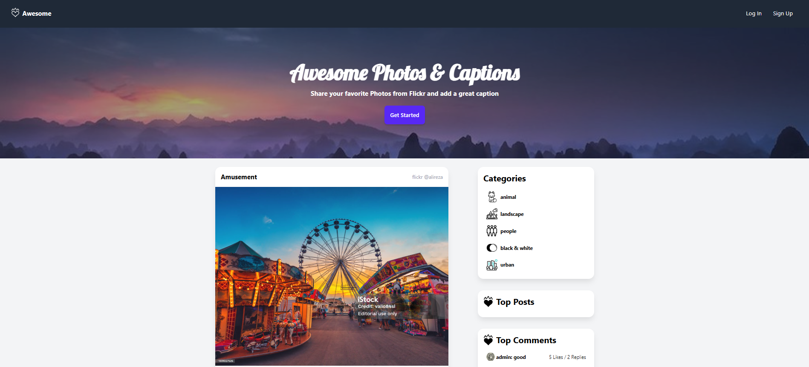

# Django Awesome

Django Awesome is a social platform where users can upload and share photos, comment on them, and chat with others. Built with Django and HTMX, it provides a responsive interface with features like user authentication, real-time messaging, and photo sharing.

## Screenshots

          


## Django Social Photo App

A social photo-sharing app built with Django where users can upload photos, share them with others, leave comments, and chat with each other.

## Features

- **User registration and login:** Secure authentication features.
- **Uploading and viewing photos:** A smooth interface for managing photos.
- **Commenting on photos:** Engage with content and provide feedback.
- **Real-time chat between users:** Enjoy seamless, live communication.
- **Responsive UI with Tailwind CSS:** A clean and responsive user interface.
- **User avatars for profiles:** Enhance user identity representation.

## Technologies Used

- **Django** (Backend)
- **HTMX + TailwindCSS** (Frontend)
- **Pillow** for image processing
- **SQLite** (with the option to switch to PostgreSQL)
- **JavaScript**

## Installation

Follow these steps to set up and run the project locally:

1. **Clone the Repository**

   Open your terminal and clone the repository using:
   ```bash
   git clone https://github.com/alirezasalimzadeh/django-awesome.git
   cd django-awesome
   
2. **Create and Activate a Virtual Environment**
   
   It is highly recommended to use a virtual environment to manage project dependencies:
   On Windows:
      ```bash
      python -m venv venv
      venv\Scripts\activate
   ```
   On macOS and Linux:
      ```bash
      python3 -m venv venv
      source venv/bin/activate
   ```
3. **Install Dependencies**

   Install the required packages listed in the requirements.txt file:
   ```bash
      pip install -r requirements.txt
   ```

4. **Apply Migrations**

   Set up your database by applying Django migrations:
   ```bash
      python manage.py migrate
   ```
5. **Create a Superuser (Optional)**
   
   To access the Django admin panel, create a superuser:
   ```bash
      python manage.py createsuperuser
   ```
   
   Follow the prompts to complete the user creation.
   
6. **Run the Development Server**
   Start the Django development server:
   ```bash
   python manage.py runserver
   ```
   
   To ensure your Django project runs securely and efficiently, follow these steps to set up environment-specific variables:
7. **Create a .env File**
   At the root of your project (same level as manage.py), create a .env file to store sensitive information:
   ```bash
   SECRET_KEY=
   ENCRYPT_KEY=
   DEBUG=True
   EMAIL_HOST_USER=
   EMAIL_HOST_PASSWORD=
   ```
   Note: Ensure that your .env file is listed in your .gitignore to prevent sensitive data from being committed to version control.
   
8. Generate a New SECRET_KEY
   Django uses the SECRET_KEY for cryptographic signing. To generate a new, secure key:
      ```bash
      python -c 'from django.core.management.utils import get_random_secret_key; print(get_random_secret_key())'
      ```
      Copy the output and paste it into the SECRET_KEY field in your .env file.
   
9. Generate an ENCRYPT_KEY (Optional)
   If your project requires an encryption key (e.g., for encrypting sensitive data), you can generate one using Python's cryptography library:
   1. Install the library:
       ```bash
       pip install cryptography
       ```
   2. Generate the key:
      ```bash
      from cryptography.fernet import Fernet
      
      key = Fernet.generate_key()
      print(key.decode())
      ```
   Copy the output and paste it into the ENCRYPT_KEY field in your .env file.

10. **Configure Django to Use Environment Variables**
    Ensure your Django settings are configured to read from the .env file. You can use the python-dotenv package for this purpose:
    1. Install python-dotenv:
        ```bash
          pip install python-dotenv
        ```
    2. In your settings.py, add the following at the top:
       ```bash
          import os
         from dotenv import load_dotenv
         load_dotenv()
       ```
    3. Retrieve environment variables:
       ```bash
       SECRET_KEY = os.getenv('SECRET_KEY')
       ENCRYPT_KEY = os.getenv('ENCRYPT_KEY')
       DEBUG = os.getenv('DEBUG') == 'True'
       EMAIL_HOST_USER = os.getenv('EMAIL_HOST_USER')
       EMAIL_HOST_PASSWORD = os.getenv('EMAIL_HOST_PASSWORD')
       ```
By following these steps, you ensure that sensitive information remains secure and that your project is configured correctly for different environments.


Then, open your browser and navigate to http://127.0.0.1:8000/ to see your project in action.

11. **Additional Configuration**
   
   If your project requires environment-specific variables (like SECRET_KEY or DEBUG), create a .env file in the project root based on the provided template (if available).
   For production environments, make sure to configure your static files settings and run:
   ```bash
   python manage.py collectstatic
   ```
